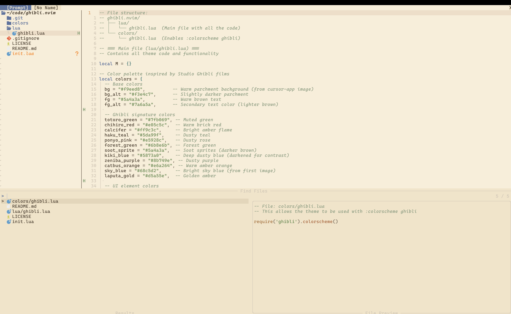

# 🌱 Ghibli.nvim

A whimsical Neovim color scheme inspired by the magical worlds of Studio Ghibli films, featuring warm parchment tones, soft blue accents, and the iconic Ghibli aesthetic.
 


## ✨ Features

- 🎨 Color palette inspired by various Studio Ghibli films
- 🌿 Balanced color scheme with warm parchment background and soft accents
- 🌅 Bright, warm theme evoking the sunlit scenes of Ghibli films
- 🌙 Medium-dark theme inspired by the nostalgic glow of Ghibli's indoor scenes
- 🔄 Easy toggle between light and dark modes
- 🌟 Support for Treesitter, LSP, and popular plugins
- 🖋️ Font recommendations to complete the Ghibli aesthetic

## 🌊 Installation

### Using [packer.nvim](https://github.com/wbthomason/packer.nvim)

```lua
use {
  'patil-suraj/ghibli.nvim',
  config = function()
    -- Setup with options (optional)
    require('ghibli').setup({
      style = "light", -- "light" or "dark"
    })
    
    -- Load the colorscheme
    require('ghibli').colorscheme()
  end
}
```

### Using [lazy.nvim](https://github.com/folke/lazy.nvim)

```lua
{
  'patil-suraj/ghibli.nvim',
  lazy = false, -- make sure we load this during startup
  priority = 1000, -- load before other plugins
  config = function()
    -- Setup with options (optional)
    require('ghibli').setup({
      style = "light", -- "light" or "dark"
    })
    
    require('ghibli').colorscheme()
  end,
}
```

### Using [vim-plug](https://github.com/junegunn/vim-plug)

```vim
Plug 'patil-suraj/ghibli.nvim'
```

After installation with vim-plug, add to your init.vim:

```vim
" Optional: set style before loading
lua require('ghibli').setup({style = "light"})
colorscheme ghibli
```

## 🍃 Usage

After installation, set the colorscheme:

```vim
" In Vim script
colorscheme ghibli
```

```lua
-- In Lua
vim.cmd[[colorscheme ghibli]]
```

Or use the plugin command:

```vim
:GhibliTheme
```

### Style Configuration

You can configure the color scheme style (light or dark) before loading:

```lua
-- Configure with light style (default)
require('ghibli').setup({
  style = "light", -- "light" or "dark"
})

-- Apply the colorscheme
require('ghibli').colorscheme()
```

### Toggling Between Styles

Toggle between light and dark modes with the provided command:

```vim
:GhibliToggle
```

You can also map this to a key in your configuration:

```lua
-- Example: Toggle with <leader>ts
vim.keymap.set('n', '<leader>ts', require('ghibli').toggle, { noremap = true, silent = true })
```

## 🌸 Font Recommendations

For the complete Ghibli experience, consider using one of these fonts:

- **JetBrains Mono** - Clean, modern font with ligatures
- **Cascadia Code** - Beautiful coding font with ligatures
- **Comic Mono** - A legible monospace version of Comic Sans that gives a slight hand-drawn feel
- **Victor Mono** - Features beautiful italics perfect for the theme's italic comments


## 🧙‍♂️ Inspiration

The color palette draws inspiration from various Studio Ghibli films:

- **My Neighbor Totoro** - Warm, nostalgic greens and earthy tones
- **Spirited Away** - Rich ambers and vintage parchment
- **Howl's Moving Castle** - Warm machinery tones and soft parchment
- **Ponyo** - Coral accents and bright skies
- **Princess Mononoke** - Forest greens and natural tones
- **Kiki's Delivery Service** - Deep, dusty blues and warm browns

<!-- ## 📸 Screenshots


 -->

## 🌟 Credits

Created with love by a Ghibli fan for Ghibli fans who code.

## 📝 License

MIT License